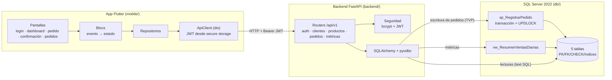

# Sistema de Gestión de Pedidos e Inventario Móvil — Desafío Técnico Tech Lead

PoC full-stack para una compañía de logística y distribución: operadores de campo consultan stock, registran pedidos de clientes, actualizan su estado y visualizan métricas de operación.

**Stack:** Flutter (Dart) · Python (FastAPI) · Microsoft SQL Server

## Estructura del repositorio

```
my-techlead-challenge/
├── db/
│   ├── 01_schema.sql        # DDL: tablas, PKs, FKs, CHECKs, índices
│   ├── 02_procedures.sql    # Stored procedures y vistas
│   └── 03_seed_data.sql     # Datos de prueba iniciales
├── backend/
│   ├── app/                 # Código fuente FastAPI
│   ├── requirements.txt     # Dependencias Python
│   └── Dockerfile           # Contenedor del backend
├── mobile/
│   ├── lib/                 # Código fuente Flutter
│   └── pubspec.yaml         # Dependencias Flutter
├── scripts/
│   └── smoke_api.ps1        # Suite E2E de la API (23 casos)
├── docker-compose.yml       # SQL Server + backend con un comando
└── README.md
```

## Cómo levantar el sistema

```bash
# 1. Base de datos + backend
docker compose up -d

# 2. App móvil (emulador Android)
cd mobile
flutter pub get
flutter run
```

> La app detecta la plataforma: en emulador Android usa `http://10.0.2.2:8000` (el localhost del host) y en desktop/web `http://localhost:8000`. Para un dispositivo físico: `flutter run --dart-define=API_BASE_URL=http://IP-DE-TU-PC:8000`.

> Los scripts de `db/` se ejecutan automáticamente contra el contenedor de SQL Server en orden (01 → 02 → 03).

Para validar la API completa (22 casos: happy path + errores 400/401/404/409):

```powershell
powershell -ExecutionPolicy Bypass -File .\scripts\smoke_api.ps1
```

La documentación interactiva (OpenAPI) queda disponible en `http://localhost:8000/docs`.

**Credenciales de prueba** (creadas por `db/03_seed_data.sql`, hash bcrypt):

| Usuario   | Contraseña     | Rol en la demo      |
|-----------|----------------|---------------------|
| `operador` | `Operador123!` | Operador de campo   |
| `admin`    | `Admin123!`    | Supervisor          |
| `demo`     | `Demo123!`     | Usuario de prueba   |

## Supuestos y decisiones de diseño

El enunciado deja puntos abiertos o inconsistentes. Se listan los supuestos adoptados y su justificación:

### Alcance funcional

1. **Actualización de estado de pedidos.** El escenario de negocio lo menciona pero no figura entre los endpoints ni pantallas requeridos. Se agrega `GET /api/v1/pedidos` (listado con filtro por estado), `PATCH /api/v1/pedidos/{id}/estado` y una quinta pantalla en la app (Pedidos → Detalle) para que el operador avance el ciclo de vida o cancele (reponiendo stock) desde el dispositivo.
2. **Métricas.** La vista `vw_ResumenVentasDiarias` se pide "optimizada para consumo desde el backend", pero no hay endpoint asociado. Se expone `GET /api/v1/metricas` que la consume y el Dashboard muestra los indicadores clave.
3. **"Tiempo real".** Se interpreta como consistencia inmediata de datos on-demand (stock actualizado atómicamente al registrar pedidos), no como push/websockets. Notificaciones en tiempo real quedan como evolución futura, fuera del alcance de un PoC de 12-16 hs.
4. **Clientes ≠ Usuarios.** El usuario es el operador que se autentica; el cliente es quien recibe el pedido. Se modela una quinta tabla `Clientes` (el mínimo de 4 tablas lo permite), coherente con la vista que consolida ventas por cliente. Se expone además `GET /api/v1/clientes` (no estaba en el enunciado): `POST /pedidos` exige `cliente_id` y el formulario móvil necesita ofrecer las opciones.
5. **Sin registro de usuarios.** No se pide signup. Los operadores se crean en el seed script con contraseñas hasheadas (bcrypt); las credenciales de prueba se documentan en este README.

### Decisiones técnicas

6. **FastAPI** (el enunciado alterna entre FastAPI/DRF y FastAPI/Flask): es el único framework mencionado en ambas secciones, integra Pydantic nativamente (validación exigida) y genera documentación OpenAPI automática.
7. **Acceso a datos híbrido:** SQLAlchemy sobre `pyodbc` para lecturas; llamada directa al stored procedure `sp_RegistrarPedido` para la creación de pedidos. La lógica transaccional vive en el SP (como exige el enunciado) y el backend la respeta sin duplicarla.
8. **BLoC** como gestor de estado en Flutter: aunque para un PoC pequeño Riverpod tendría menos boilerplate, se prioriza dejar la base lista para escalar — el patrón evento→estado da trazabilidad completa de las interacciones, es el estándar más extendido en equipos grandes (onboarding más simple) y separa por contrato la UI de la lógica de negocio. El costo extra de ceremonia se acepta como inversión.
9. **`flutter_secure_storage`** para el JWT: `shared_preferences` almacena en texto plano y contradice el énfasis del enunciado en seguridad.
10. **Paginación Y filtro** en `GET /api/v1/productos` (el "o" del enunciado permitía uno solo): el filtro es obligatorio de facto por la pantalla de búsqueda, y la paginación tiene costo marginal mínimo.
11. **Docker no-opcional en la práctica:** `docker-compose.yml` levanta SQL Server 2022 + backend y ejecuta los scripts SQL en orden, para que la evaluación sea reproducible con un comando.

### Reglas de negocio

12. **Stock insuficiente:** `sp_RegistrarPedido` valida stock dentro de la transacción (con `UPDLOCK` para concurrencia entre operadores), hace `ROLLBACK` y lanza error; la API responde `409 Conflict` y la app lo muestra en la pantalla de confirmación.
13. **Estados de pedido:** conjunto cerrado — `Pendiente`, `EnPreparacion`, `Enviado`, `Entregado`, `Cancelado` — con restricción `CHECK`.
14. **Momento del descuento de stock:** al crear el pedido; si se cancela, se repone.
15. **JWT:** access token con expiración de 60 minutos, sin refresh token. En producción se agregaría refresh + revocación.

## Deuda técnica declarada / evolución futura

- Tests automatizados completos. Hoy existen: suite E2E de la API (`scripts/smoke_api.ps1`, 23 casos que cubren login, catálogo, creación de pedido, stock insuficiente, transiciones de estado y métricas) y widget tests de Flutter (arranque y validación del login). Faltarían: tests unitarios pytest del backend, tests de blocs (`bloc_test`) y de integración móvil.
- CI/CD (lint + tests + build en pipeline).
- Refresh tokens y revocación de sesiones.
- Notificaciones en tiempo real (websockets / SignalR) para estados de pedido.
- Monitoreo y observabilidad (logs estructurados, métricas, tracing).
- Migraciones versionadas de base de datos (Alembic / DbUp) en lugar de scripts manuales.

## Arquitectura



**Decisiones estructurales clave** (detalle en los supuestos de abajo):

- **La lógica transaccional vive en la base**: `POST /pedidos` arma un Table-Valued Parameter y delega en `sp_RegistrarPedido`, que valida stock con `UPDLOCK + HOLDLOCK` dentro de una transacción explícita. El backend traduce los códigos de error de negocio del SP (`THROW 5000x`) a códigos HTTP (409/404/400) sin duplicar reglas.
- **Backend por capas**: routers → seguridad/esquemas → acceso a datos. Sin ORM declarativo: lecturas con SQL parametrizado y escrituras vía SP (decisión #7).
- **Móvil por capas con BLoC**: presentación (pantallas + blocs) → repositorios → ApiClient. El JWT se guarda en `flutter_secure_storage` y un interceptor de dio lo inyecta en cada request. Los errores se tipifican en `ApiException` (red vs. HTTP) para que la UI distinga "reintentar" de "volver a loguearse".
- **Orquestación reproducible**: `docker compose up` levanta SQL Server, ejecuta los scripts `db/` en orden (servicio `db-init` con healthcheck) y recién entonces arranca el backend.

## Demo

_(Link al video con demo y explicación del sistema — completar al finalizar.)_
